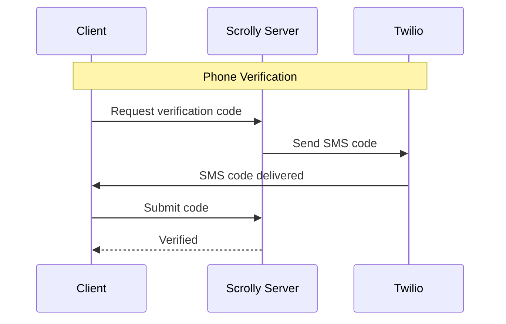

# Configuration

## System Requirements

Scrolly is a lightweight monolith — a single Node.js process serving the frontend, API, and running video downloads. It's designed to run comfortably on small VPS instances.

### Minimum

| Resource | Requirement | Notes |
|----------|-------------|-------|
| **CPU** | 1 vCPU | Sufficient for small groups (5–10 users) |
| **RAM** | 512 MB | Node.js (~100 MB) + FFmpeg spikes during downloads |
| **Disk** | 1 GB + video storage | ~500 MB for the app/dependencies, rest for media |
| **OS** | Linux (x86_64 or arm64) | Ubuntu 22.04+, Debian 12+, or any Docker-capable host |
| **Runtime** | Node.js 24+ | Included in Docker image |
| **Network** | Public IP + HTTPS | Required for push notifications |

### Recommended

| Resource | Requirement | Notes |
|----------|-------------|-------|
| **CPU** | 2 vCPUs | Handles concurrent video downloads without lag |
| **RAM** | 1 GB | Comfortable headroom for FFmpeg transcoding |
| **Disk** | 20–50 GB SSD | Videos average 10–50 MB each; depends on group activity and retention policy |

### Software Dependencies

Included in the Docker image. For manual deployments, install these:

| Dependency | Version | Purpose |
|------------|---------|---------|
| **Node.js** | 24+ | Application runtime |
| **FFmpeg** | 4.4+ | Media processing and thumbnail generation |
| **Python 3** | 3.10+ | Required by some download providers |

Download providers are installed at runtime by the host from the Settings UI — they are not bundled with or automatically installed by Scrolly. Installing a provider is an explicit opt-in action; by doing so, the host accepts responsibility for compliance with applicable laws and the provider's own license terms. See the [Disclaimer](https://github.com/312-dev/scrolly/blob/main/DISCLAIMER.md) for full details.

### Storage Considerations

- **Video files** are the primary storage consumer. A typical TikTok clip is 10–50 MB, longer YouTube videos can be 100+ MB.
- Use the **retention policy** (Settings > Storage) to automatically delete old clips and reclaim disk space.
- The **storage cap** setting prevents the group from exceeding a disk budget.
- SQLite database is negligible in size (typically under 10 MB even with thousands of clips).
- Monitor disk usage with `docker system df` or check the group stats in Settings.

## Environment Variables

Scrolly is configured via environment variables. Copy `.env.example` to `.env` and fill in the values.

## Required Variables

| Variable | Description |
|----------|-------------|
| `SESSION_SECRET` | Secret key for signing session cookies. Use a long random string. |
| `TWILIO_ACCOUNT_SID` | Your Twilio account SID |
| `TWILIO_AUTH_TOKEN` | Your Twilio auth token |
| `TWILIO_VERIFY_SERVICE_SID` | Your Twilio Verify service SID (used for phone verification) |
| `PUBLIC_APP_URL` | Public URL of your instance (e.g. `https://scrolly.example.com`). Required for CSRF, webhooks, and invite links. |

## Push Notifications

Generate VAPID keys with `npx web-push generate-vapid-keys`, then set:

| Variable | Description |
|----------|-------------|
| `VAPID_PUBLIC_KEY` | Public VAPID key |
| `VAPID_PRIVATE_KEY` | Private VAPID key |
| `VAPID_SUBJECT` | Contact URL or mailto (e.g. `mailto:you@example.com`) |

Push notifications won't work without these. The app will still function, but users won't receive real-time alerts.

## Optional Variables

| Variable | Default | Description |
|----------|---------|-------------|
| `PORT` | `3000` | Port the server listens on |
| `HOST` | `0.0.0.0` | Host to bind to |
| `VERIFY_CHANNELS` | `sms` | Comma-separated verification channels (e.g. `sms`, `email`) |
| `SMS_DEV_MODE` | `false` | Set to `true` to bypass Twilio and auto-approve any verification code (dev/testing only) |
| `GIPHY_API_KEY` | — | Giphy API key for GIF search in comments. Get one at [developers.giphy.com](https://developers.giphy.com/) |
| `DATA_DIR` | `./data` | Directory for database and media files |
| `LOG_LEVEL` | `info` | Logging level (`trace`, `debug`, `info`, `warn`, `error`, `fatal`) |
| `BACKUP_RETENTION_COUNT` | `7` | Number of daily database backups to keep |
| `PUBLIC_TERMS_URL` | — | URL to your Terms of Service (shown in SMS consent text) |
| `PUBLIC_PRIVACY_URL` | — | URL to your Privacy Policy (shown in SMS consent text) |
| `DOMAIN` | — | Domain for Caddy HTTPS (used with `docker-compose.caddy.yml`) |

## Twilio Setup

1. Create a [Twilio account](https://www.twilio.com)
2. Create a Verify service in the Twilio console
3. Add the account SID, auth token, and Verify service SID to your `.env`

Twilio is used for **phone verification only** — SMS codes during onboarding and login. Clip sharing is handled in-app, via Android share target, or iOS Shortcut.

## Data Storage

Scrolly stores all data locally:

- **Database:** SQLite file at `data/scrolly.db`
- **Media:** Videos, audio, and thumbnails in `data/videos/`

In Docker, this is persisted via a named volume. For manual deployments, ensure the `data/` directory exists and is writable.
