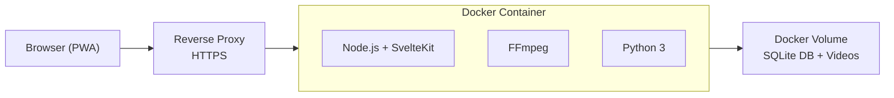

# Docker Deployment

The recommended way to run Scrolly in production. A single container includes Node.js, FFmpeg, and Python 3. Download providers are installed at runtime by the host from the Settings UI.



## Install

```bash
# Download compose file and env template
curl -LO https://raw.githubusercontent.com/312-dev/scrolly/main/docker-compose.yml
curl -LO https://raw.githubusercontent.com/312-dev/scrolly/main/.env.example
cp .env.example .env

# Configure (see Configuration page for details)
nano .env

# Start
docker compose up -d
```

The app will be available at `http://localhost:3000`. Database migrations run automatically on every startup.

## Upgrade

Check the [Releases](https://github.com/312-dev/scrolly/releases) page for the latest version and changelog.

```bash
# 1. Update the image tag in docker-compose.yml to the new version
#    image: ghcr.io/312-dev/scrolly:1.1.0

# 2. Pull and restart
docker compose pull
docker compose up -d
```

Migrations run automatically on startup. A backup of the database is created automatically before migrations run (stored in `data/backups/` inside the Docker volume).

### Rollback

If something goes wrong after upgrading:

```bash
# 1. Stop the container
docker compose down

# 2. List available backups
docker run --rm -v scrolly_scrolly-data:/data alpine ls -la /data/backups/

# 3. Restore the pre-upgrade backup
docker run --rm -v scrolly_scrolly-data:/data \
  alpine cp /data/backups/scrolly-<TIMESTAMP>.db /data/scrolly.db

# 4. Revert docker-compose.yml to the previous image tag
#    image: ghcr.io/312-dev/scrolly:1.0.0

# 5. Start with the old version
docker compose pull
docker compose up -d
```

## Version Pinning

Edit `docker-compose.yml` to control which version you run:

```yaml
image: ghcr.io/312-dev/scrolly:1.0.0   # Exact version (recommended)
image: ghcr.io/312-dev/scrolly:1.0      # Latest patch in 1.0.x
image: ghcr.io/312-dev/scrolly:latest   # Always newest (not recommended for production)
```

All versions are listed on the [Releases](https://github.com/312-dev/scrolly/releases) page.

## Auto-Updates

Uncomment the Watchtower service in `docker-compose.yml` to automatically pull new images daily.

## Backup

Scrolly automatically creates a database backup before every migration (stored at `data/backups/` inside the Docker volume). These are created each time the container starts, so you'll have a backup from just before each upgrade.

To create a full manual backup (database + videos):

```bash
docker run --rm \
  -v scrolly_scrolly-data:/data \
  -v $(pwd):/backup \
  alpine tar czf /backup/scrolly-backup-$(date +%Y%m%d).tar.gz -C / data
```

## Reverse Proxy

Scrolly should sit behind a reverse proxy for HTTPS. Example with Caddy:

```
scrolly.example.com {
    reverse_proxy localhost:3000
}
```

Nginx and Traefik work equally well.

## Self-Hosting Responsibilities

By operating a self-hosted instance, you are responsible for:

- All content downloaded, stored, and shared on your instance
- Compliance with data protection laws (GDPR, CCPA, etc.)
- Compliance with telecommunications regulations if using SMS
- Establishing your own terms of service and privacy policy
- Securing your deployment and protecting user data
- **Download providers:** Installing a provider is an explicit opt-in action. By doing so, you accept responsibility for compliance with applicable laws and the provider's own license terms. No download tools are bundled with or automatically installed by Scrolly.

See the [Disclaimer](https://github.com/312-dev/scrolly/blob/main/DISCLAIMER.md) for full details.
