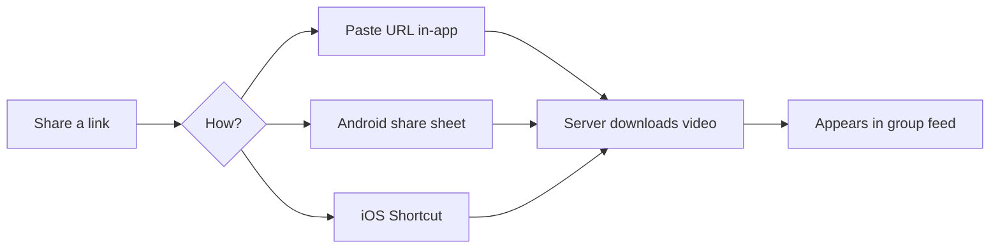

# Features

## Video Sharing

Share links from TikTok, Instagram, YouTube, Facebook, and more. Videos are downloaded server-side via a pluggable download provider and re-hosted from your server. The host installs a provider from the Settings UI — no download tools are bundled with Scrolly.

**How to share:**
- **In-app** — Paste a URL into the add-video modal.
- **Android share sheet** — Share directly from any app (PWA share target).
- **iOS Shortcut** — Use the iOS Shortcut integration to share from any app.

Failed downloads can be retried from the UI.

## Music Sharing

Share Spotify, Apple Music, or YouTube Music links. Scrolly resolves cross-platform links via [Odesli](https://odesli.co) so everyone can listen on their preferred service. Audio is downloaded and served with album art in a dedicated music player.

## Feed & Interactions

A TikTok-style full-screen vertical feed with:

- **Reactions** — Emoji reactions with animated effects
- **Threaded comments** — Nested replies with hearts
- **View tracking** — See who watched each clip and how far they got
- **Favorites** — Save clips and filter your feed
- **Editable captions** — The poster can edit before others watch

## Private Groups

- **Invite-only** — Groups are accessed via unique invite codes
- **Customizable** — Host can set group name and accent color
- **Host controls** — Manage members, regenerate invite codes, set retention policies, monitor storage

## Notifications

- **In-app activity feed** — New clips, reactions, and comments with unread badges
- **Push notifications** — Real-time alerts via Web Push (VAPID)
- **Per-user preferences** — Toggle each notification type on/off

## User Identity

Passwordless onboarding — no passwords to remember:

Log back in anytime with your phone number.

Profile includes avatar upload, theme preference (system/light/dark), and playback preferences (mute, auto-scroll, speed).

## PWA

Scrolly is a fully installable Progressive Web App:

- Add to home screen on any device
- Offline fallback page via service worker
- Android share target for direct sharing from other apps
- App update prompts when new versions are deployed
