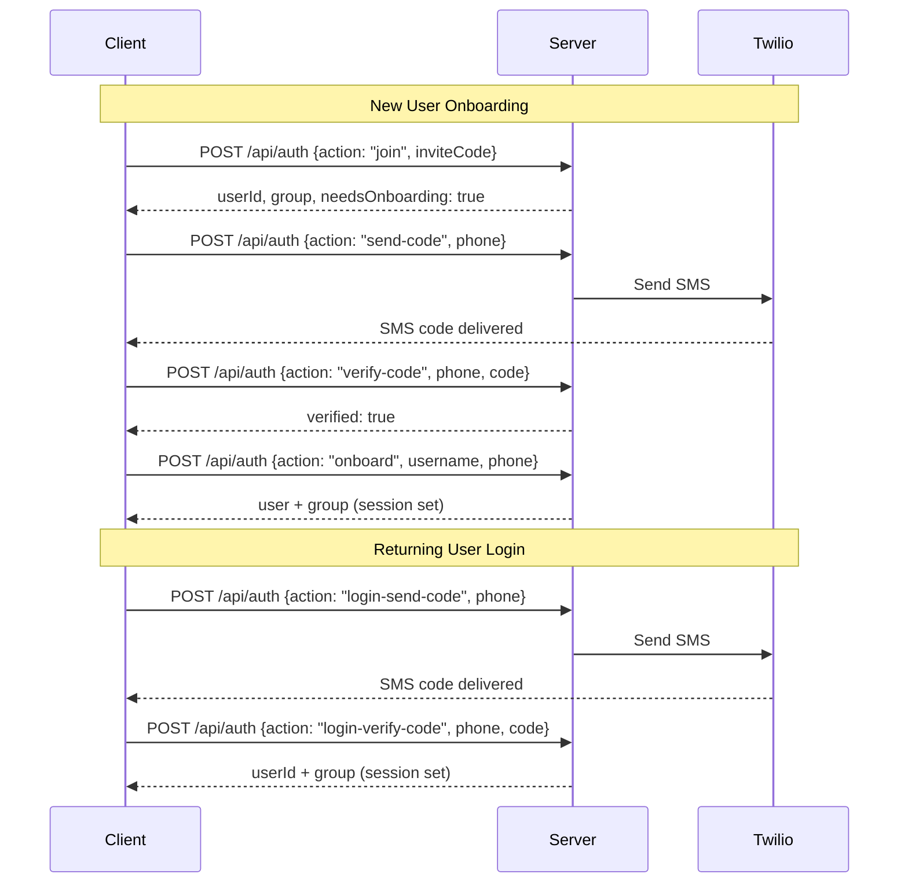

# API Reference

All API routes are SvelteKit `+server.ts` files under `src/routes/api/`. Authenticated endpoints require a valid session cookie. Errors return `{ error: string }` with an appropriate HTTP status.

## Auth



### `GET /api/auth`

Returns the current user and group info.

```json
{
  "user": { "id", "username", "phone", "groupId", "themePreference", "avatarPath" },
  "group": { "id", "name", "inviteCode", "accentColor", "retentionDays" }
}
```

### `POST /api/auth`

Dispatches by `action` field:

| Action | Description |
|--------|-------------|
| `join` | Join a group via invite code |
| `login-send-code` | Send login verification code |
| `login-verify-code` | Verify login code |
| `send-code` | Send verification code (onboarding) |
| `verify-code` | Verify code (onboarding) |
| `onboard` | Complete onboarding with username and phone |

## Clips

### `GET /api/clips`

List clips for the user's group.

| Param | Description |
|-------|-------------|
| `filter` | `unwatched`, `watched`, or `favorites` |
| `limit` | Number of clips (default 20) |
| `offset` | Pagination offset |

### `POST /api/clips`

Submit a URL to download.

```json
{ "url": "https://tiktok.com/...", "title": "optional caption" }
```

Returns `{ "clip": { "id", "status": "downloading", "contentType" } }` (201 Created).

### `POST /api/clips/share`

Submit a URL via iOS Shortcut token (`?token=`). No session cookie needed.

```json
{ "url": "https://tiktok.com/...", "phones": ["+1234567890"] }
```

### `GET /api/clips/[id]`

Single clip detail.

### `PATCH /api/clips/[id]`

Update clip title. Only allowed by the uploader, and only if no one else has watched the clip. Returns `{ "title": "..." }`.

### `DELETE /api/clips/[id]`

Remove a clip. Only allowed by the uploader, and only if no one else has watched.

### `GET /api/clips/unwatched-count`

Returns `{ "count": 5 }`.

## Interactions

### `POST /api/clips/[id]/watched`

Mark a clip as watched. Optional `watchPercent` (0-100).

### `DELETE /api/clips/[id]/watched`

Mark a clip as unwatched.

### `POST /api/clips/[id]/favorite`

Toggle favorite. Returns `{ "favorited": true }`.

### `GET /api/clips/[id]/views`

List who has viewed the clip with watch percentages.

### `GET /api/clips/[id]/comments`

Threaded comments with hearts and user info.

### `POST /api/clips/[id]/comments`

Add a comment. Optional `parentId` for replies.

```json
{ "text": "lmao", "parentId": "optional-comment-id" }
```

### `DELETE /api/clips/[id]/comments`

Delete a comment.

### `POST /api/clips/[id]/comments/[commentId]/heart`

Toggle heart on a comment.

### `POST /api/clips/[id]/comments/viewed`

Mark comments as viewed (clears new comment badge).

### `GET /api/clips/[id]/reactions`

List reactions with counts.

### `POST /api/clips/[id]/reactions`

Toggle a reaction. Allowed emojis: `❤️ 👍 👎 😂 ‼️ ❓`

```json
{ "emoji": "🔥" }
```

### `POST /api/clips/[id]/retry`

Retry a failed download.

## Group Management

Host-only endpoints unless noted.

### `PATCH /api/group/name`

Rename the group (1-50 chars).

### `PATCH /api/group/accent`

Change the group accent color.

### `PATCH /api/group/retention`

Set retention policy (`null`, `7`, `14`, `30`, `60`, or `90` days).

### `PATCH /api/group/max-file-size`

Set max file size limit for clips (`null` to remove limit).

### `PATCH /api/group/platforms`

Set platform filter mode (`all`, `allow`, or `block`) and platform list.

### `GET /api/group/provider`

List available download providers with installation status.

### `PATCH /api/group/provider`

Set the active download provider.

### `POST /api/group/provider/install`

Install a download provider binary.

### `DELETE /api/group/provider/install`

Uninstall a download provider binary.

### `POST /api/group/invite-code/regenerate`

Generate a new invite code, invalidating the old one.

### `PATCH /api/group/shortcut`

Set iOS Shortcut integration URL.

### `POST /api/group/shortcut/regenerate-token`

Regenerate the iOS Shortcut authentication token.

### `GET /api/group/members`

List group members with roles.

### `POST /api/group/members`

Add a new member to the group (host-only).

### `DELETE /api/group/members/[userId]`

Remove a member (soft-delete).

### `GET /api/group/clips`

List clips with storage info. Supports `sort` (`newest` or `largest`), `limit`, `offset`.

### `DELETE /api/group/clips`

Batch delete clips by IDs.

### `GET /api/group/stats`

Group statistics: clip count, member count, storage usage.

## Notifications

### `GET /api/notifications`

Paginated notification feed. Supports `limit` and `offset`.

### `POST /api/notifications/mark-read`

Mark notifications as read. Send `{ "all": true }` or `{ "clipId": "...", "type": "comment" }`.

### `GET /api/notifications/unread-count`

Returns `{ "count": 3 }`.

### `GET /api/notifications/preferences`

Fetch notification preferences.

### `PATCH /api/notifications/preferences`

Update preferences:

```json
{ "newAdds": true, "reactions": true, "comments": false, "dailyReminder": false }
```

## Profile

### `POST /api/profile/preferences`

Update user preferences. All fields optional:

```json
{ "themePreference": "dark", "autoScroll": true, "mutedByDefault": false }
```

### `POST /api/profile/avatar`

Upload a profile picture as `multipart/form-data`.

### `DELETE /api/profile/avatar`

Delete the user's profile avatar.

### `GET /api/profile/avatar/[filename]`

Serve an avatar image.

## GIFs

### `GET /api/gifs/search`

Search or list trending GIFs (requires `GIPHY_API_KEY`). Query params: `q`, `limit`, `offset`.

## Push Notifications

### `POST /api/push/subscribe`

Register a push subscription with endpoint and keys.

### `DELETE /api/push/subscribe`

Unregister a push subscription.

## Media

### `GET /api/videos/[filename]`

Serve video with range request support (HTTP 206).

### `GET /api/thumbnails/[filename]`

Serve thumbnail images.

## Health

### `GET /api/health`

Returns `{ "status": "ok", "version": "1.0.0", "uptime": 12345 }`.
